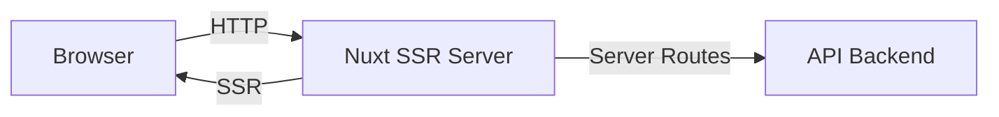

# 4Record Site — Nuxt 3 Frontend

Frontend application for the 4Record board game logging platform. Built with Nuxt 3 (SSR)
and acts as a BFF (Backend-for-Frontend) proxy to the API.

## Tech Stack

- **Framework:** Nuxt 3.21 (Vue 3, TypeScript, Vite 7)
- **CSS:** PostCSS + BEM methodology
- **Rendering:** Server-Side Rendering (SSR)
- **Design System:** Storybook 10 (vue3-vite)
- **Linting:** ESLint 10 (@nuxt/eslint, stylistic), Stylelint 17
- **Testing:** Vitest 4, @vue/test-utils, happy-dom
- **Git Hooks:** simple-git-hooks + lint-staged (pre-commit)
- **Package Manager:** pnpm
- **Component Architecture:** BEM methodology (target)

## Quick Start

```bash
# Install dependencies
pnpm install

# Start development server (http://localhost:3000)
pnpm dev

# Start Storybook (http://localhost:6006)
pnpm design
```

## Available Scripts

| Command             | Description                      |
|---------------------|----------------------------------|
| `pnpm dev`          | Start dev server with HMR        |
| `pnpm build`        | Build for production             |
| `pnpm preview`      | Preview production build locally |
| `pnpm generate`     | Generate static site             |
| `pnpm design`       | Start Storybook dev server       |
| `pnpm design:build` | Build static Storybook           |
| `pnpm lint`         | Run ESLint                       |
| `pnpm lint:fix`     | Run ESLint with auto-fix         |
| `pnpm lint:css`     | Run Stylelint                    |
| `pnpm lint:css:fix` | Run Stylelint with auto-fix      |
| `pnpm test`         | Run Vitest (single run)          |
| `pnpm test:watch`   | Run Vitest in watch mode         |
| `pnpm typecheck`    | Run Nuxt type checking           |

## Architecture

The site uses BFF (Backend-for-Frontend) pattern: Nuxt server routes proxy API calls to the backend, keeping API
credentials and URLs server-side only.



### Runtime Configuration

Environment variables (set via `nuxt.config.ts` runtimeConfig):

| Variable            | Description              |
|---------------------|--------------------------|
| `apiHelloWorldHost` | Hello World API endpoint |
| `apiGameHost`       | Games API endpoint       |

## Project Structure

```
site/
├── components/          # Vue components
│   ├── GameCard/        # Game display card
│   └── MainMenu/        # Navigation menu
├── pages/               # File-based routing
│   ├── index.vue        # Home page
│   ├── about.vue        # About page
│   ├── game/
│   │   ├── index.vue    # Games list
│   │   └── [slug].vue   # Game detail page
│   └── user/
│       ├── index.vue    # Users list
│       └── [login].vue  # User profile page
├── server/              # Nuxt server (BFF proxy)
│   ├── api/             # API proxy routes
│   │   ├── games/       # Games proxy
│   │   └── hello-world.ts
│   ├── entities/        # Server-side type definitions
│   └── middleware/      # Server middleware
├── layouts/             # Page layouts
├── utils/               # Shared utilities
├── .storybook/          # Storybook configuration
├── nuxt.config.ts       # Nuxt configuration
└── docs/                # Project documentation
```

## Documentation

- [Vision & Scope](docs/01-project-overview/01-vision.md)
- [System Design](docs/01-project-overview/02-system-design.md)
- [Getting Started](docs/02-onboarding/01-getting-started.md)
- [Project Structure](docs/02-onboarding/02-project-structure.md)
- [Architecture Decisions](docs/03-decisions/)

## Related

- [API Backend](../api/README.md) — PHP 8.4 Slim 4 backend
- [API Documentation](../api/docs/) — Backend architecture docs
- [OpenAPI Specification](../api/web/openapi.json) — API contract
