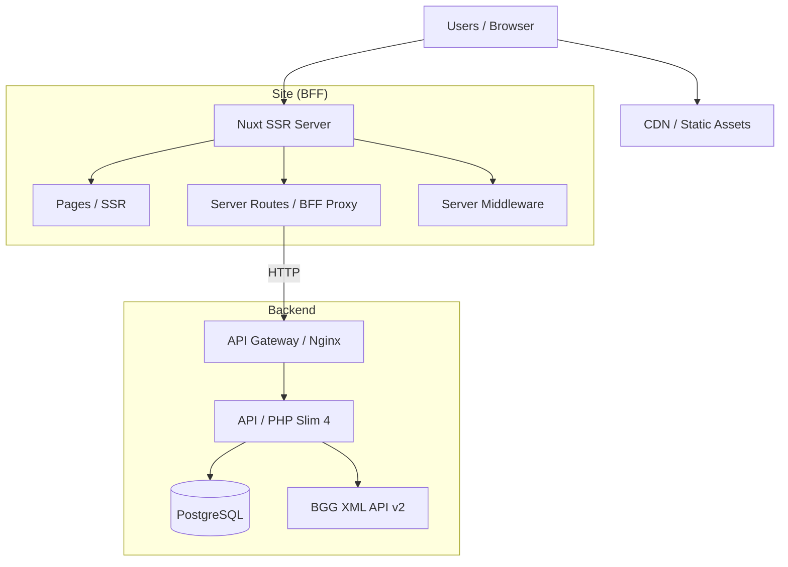
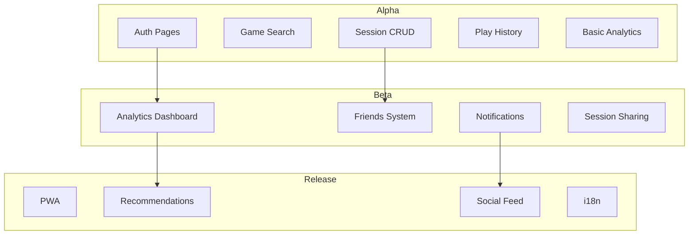
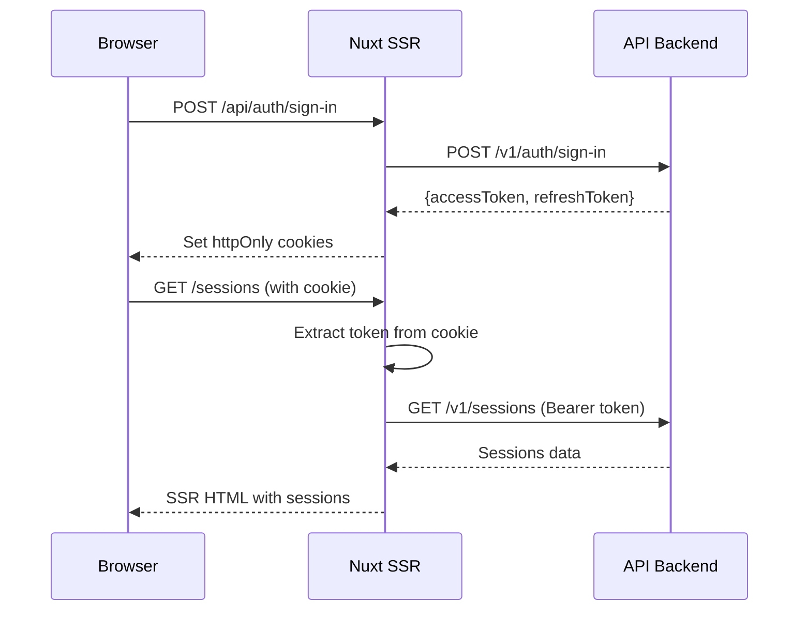
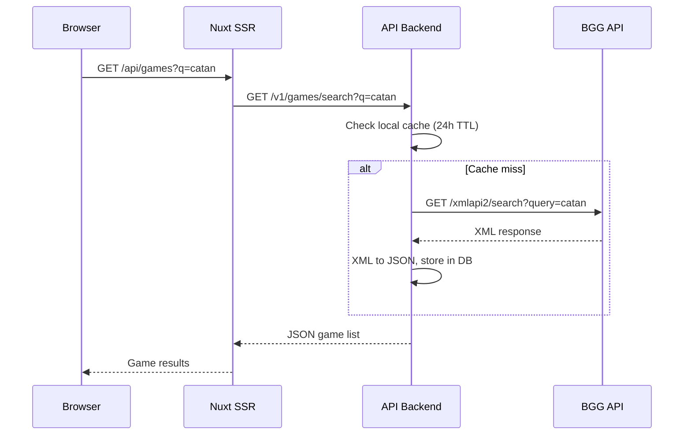
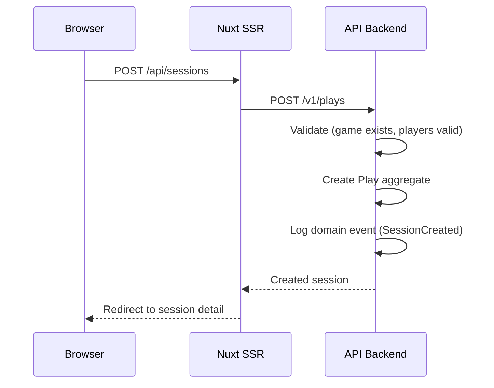
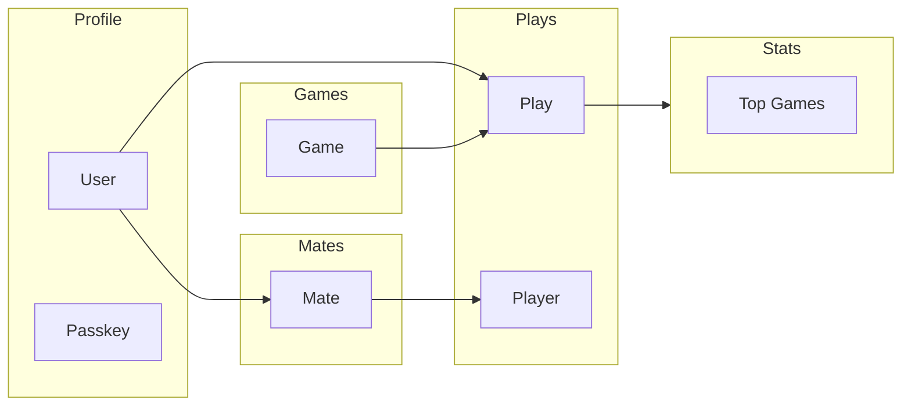
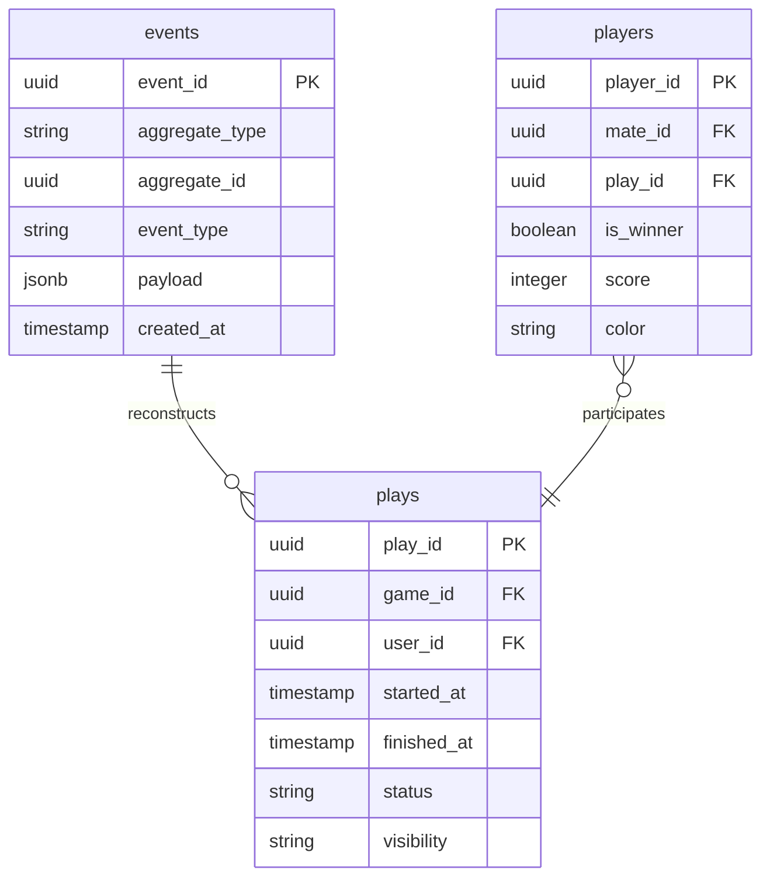

# System Design

## High-Level Architecture



## Evolution Stages



## Component Architecture

### Phase Matrix

| Component              | Alpha | Beta | RC  | Technology                |
|------------------------|-------|------|-----|---------------------------|
| SSR Pages              | +     | +    | +   | Nuxt 3, Vue 3             |
| BFF Proxy              | +     | +    | +   | Nuxt Server Routes        |
| Design System          | +     | +    | +   | Storybook 10, BEM         |
| Auth (client)          | +     | +    | +   | JWT storage, composables  |
| Game Search            | +     | +    | +   | Autocomplete, BGG proxy   |
| Session Forms          | +     | +    | +   | Vue forms, validation     |
| Analytics Charts       |       | +    | +   | Chart library (TBD)       |
| Friends UI             |       | +    | +   | User search, invites      |
| Notifications          |       | +    | +   | SSE or polling            |
| PWA                    |       |      | +   | Service Worker, manifest  |
| i18n                   |       |      | +   | @nuxtjs/i18n              |

## Data Flow

### Authentication Flow



### Game Search Flow



### Session Creation Flow



## API Contract

The API backend exposes a REST JSON API documented with OpenAPI 3.x specification.
Full spec: [`../api/web/openapi.json`](../../api/web/openapi.json)

### Key Endpoints (consumed by BFF)

| Method | Endpoint                    | Description              |
|--------|-----------------------------|--------------------------|
| POST   | `/v1/auth/sign-up`          | Register new user        |
| POST   | `/v1/auth/sign-in`          | Login, get JWT pair      |
| GET    | `/v1/auth/confirm/{token}`  | Confirm email            |
| POST   | `/v1/auth/refresh`          | Refresh token pair       |
| POST   | `/v1/auth/sign-out`         | Invalidate session       |
| GET    | `/v1/games/search`          | Search BGG games         |
| POST   | `/v1/plays`                 | Create play session      |
| GET    | `/v1/plays`                 | List play sessions       |
| GET    | `/v1/plays/{id}`            | Get play detail          |

## Domain Model (Backend)

The backend organizes domain into bounded contexts:



## Event Sourcing (Backend Foundation)

The API backend stores domain events alongside aggregates as a foundation for future event sourcing:



## Deployment

### Development
```bash
# Root level — all services via Docker
make init                    # Build and start all containers

# Site only
cd site && pnpm dev          # Dev server with HMR
cd site && pnpm design       # Storybook
```

### Production (TBD)

Production deployment strategy is not finalized yet. Currently the project runs via Docker Compose (see root `docker-compose.yml` and `docker-compose-prod.yml`).

## Monitoring & Observability

### Target Metrics

| Metric                | Alpha Target | Beta Target |
|-----------------------|--------------|-------------|
| Service availability  | 99.5%        | 99.9%       |
| Page load (TTFB)      | < 500ms      | < 200ms     |
| API response time     | < 300ms      | < 150ms     |
| BGG API error rate    | < 5%         | < 1%        |

### Stack (Planned)
- **Error tracking:** Sentry
- **Performance:** Web Vitals monitoring
- **Uptime:** Health check endpoints

## Technology Radar

```mermaid
quadrantChart
    title Technology Radar
    x-axis "Mature" --> "Emerging"
    y-axis "Hold" --> "Adopt"
    quadrant-1 "Adopt"
    quadrant-2 "Trial"
    quadrant-3 "Assess"
    quadrant-4 "Hold"

    "Nuxt 3 SSR": [0.15, 0.9]
    "Vue 3 Composition API": [0.15, 0.85]
    "Storybook 10": [0.3, 0.8]
    "BEM": [0.1, 0.75]
    "pnpm": [0.2, 0.85]
    "PWA": [0.5, 0.5]
    "i18n": [0.4, 0.4]
