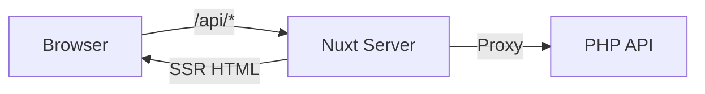

# ADR-001: Nuxt 3 SSR with BFF Pattern

**Status:** Accepted
**Date:** 2023-02

## Context

The platform needs a frontend that:
- Renders fast on first load (SEO, perceived performance)
- Communicates with the PHP API backend securely
- Keeps API credentials and internal URLs hidden from the browser

## Decision

Use **Nuxt 3** with **Server-Side Rendering (SSR)** and **BFF (Backend-for-Frontend) pattern**.

All API calls from the browser go through Nuxt server routes (`server/api/`), which proxy requests to the backend. The browser never contacts the API directly.

## Architecture

## Consequences

**Positive:**
- API host and credentials stay server-side
- SSR provides fast initial load and SEO
- Server routes can add auth headers, transform responses, cache data
- Single deployment artifact (SSR server serves both pages and API proxy)

**Negative:**
- Requires Node.js runtime in production (not static hosting)
- Adds a network hop between browser and API
- Server routes need maintenance alongside API changes

## Alternatives Considered

1. **SPA + direct API calls** — rejected: exposes API URLs to browser, no SSR
2. **Static generation (SSG)** — rejected: data is dynamic, SSG doesn't fit
3. **Separate BFF service (Express/Fastify)** — rejected: Nuxt server routes provide this out of the box
